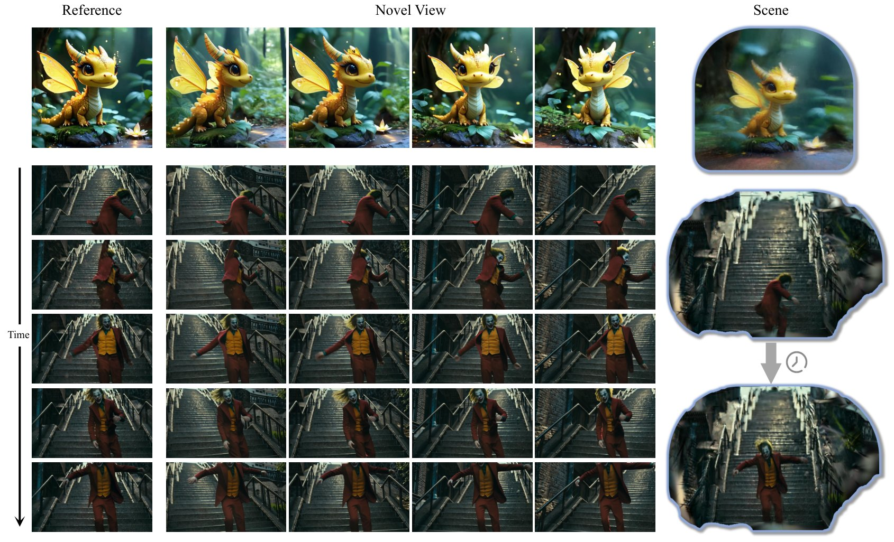

## ___***UniWorld-View: Large-Baseline View Synthesis via Video Diffusion Models***___
<div align="center">
</img>

 <a href='https://arxiv.org/abs/2608.04701'></a> &nbsp;
 <a href='https://zhouhyocean.github.io/uniworld-view/'></a> &nbsp;
 <a href='https://www.youtube.com/watch?v=ngqF_-NxFy0'></a>&nbsp;
 <a href='https://huggingface.co/Drexubery/UniView'></a> &nbsp;

</div>

🤗 If you find UniWorld-View useful, **please help ⭐ this repo**, which is important to Open-Source projects. Thanks!

## 🔥🔥🔥 Latest News
- 🎉 Jul, 2026: UniWorld-View ranked **1st** on the [WorldScore](https://huggingface.co/spaces/Howieeeee/WorldScore_Leaderboard) Leaderboard (by Stanford Prof. Fei-Fei Li's Team)

## 🔆 Introduction

UniWorld-View can generate high-fidelity novel views from <strong>casually captured monocular video</strong> or <strong>single images</strong>, while also supporting highly precise pose control. 

<div align="center">
  
</div>

For 4D reconstruction, please switch to the `recon` branch.

For Ascend NPU adaptation, please switch to the `npu` branch.

## ⚙️ Setup

### 0. GPU memory requirement

We recommend a GPU with **VRAM ≥ 60GB** for smooth inference.

### 1. Clone this repo

```bash
git clone https://github.com/PKU-YuanGroup/UniWorld-View.git
cd UniWorld-View
```

Inference expects the following third-party repos to exist under `extern/`:

```bash
git clone https://github.com/NIRVANALAN/STream3R.git extern/STream3R
```

### 2. Setup environment

```bash
conda create -n uniworld-view python=3.10 -y
conda activate uniworld-view
pip install torch==2.4.0+cu124 torchvision==0.19.0+cu124 --index-url https://download.pytorch.org/whl/cu124
pip install -r requirements.txt
pip install carvekit --no-deps
conda install -y -c conda-forge eigen
```

PyTorch3D is required by the rendering pipeline (`--render_method hybrid/mesh`). We recommend installing from source:

```bash
bash extern/install_pytorch3d.sh
```

Requirements for building PyTorch3D: CUDA toolkit with `nvcc`, and a C++ compiler (`g++` / `c++`).

Install MoSca dependencies (Optional)

```bash
pip install mmcv-full==1.7.2 --no-build-isolation
pip install pyg_lib torch_scatter torch_geometric torch_sparse torch_cluster torch_spline_conv -f https://data.pyg.org/whl/torch-2.4.0+cu121.html
pip install --no-build-isolation extern/MoSca/lib_render/simple-knn
pip install --no-build-isolation extern/MoSca/lib_render/diff-gaussian-rasterization-alphadep-add3
pip install --no-build-isolation extern/MoSca/lib_render/diff-gaussian-rasterization-alphadep
```

By default, UniWorld-View loads weights from `./checkpoints/` (see `checkpoints/README.md`).

#### Option A (recommended): download to local `./checkpoints/`

```bash
bash checkpoints/download_hf.sh
```

This downloads: UniWorld-View transformer, Wan2.1-VACE, BLIP2, MoGe, SAM2, TracerB7, and the default CausVid LoRA `v2`.
Pass the optional `--mosca` or `--stream3r` argument to additionally download the corresponding pose / depth-estimation model. See `checkpoints/README.md` for download-script details.

#### Option B: load from Hugging Face Hub (cache)

Run inference with `--no_load_weights_locally` and override repo IDs via environment variables or CLI (see `checkpoints/download_hf.py`).

## 💫 Inference

Run from the **repo root** (`UniWorld-View/`).

### 1. Command line

Our framework can plug in different reconstruction models for pose and depth estimation.

#### Option A: Bundle Adjustment

We use the MoCa module from [MoSca](https://github.com/JiahuiLei/MoSca), which runs a video diffusion model for depth estimation and then jointly optimizes camera poses and aligns the depth.

```bash
bash checkpoints/download_hf.sh --mosca
bash run_infer_mosca.sh
```

To run on a different GPU: `CUDA_DEVICE=3 bash run_infer_mosca.sh`.

#### Option B: Feed-forward Transformer (eg. VGGT, DAv3, Stream3R)

Fast inference, but with limited geometric precision. We use [STream3R](https://github.com/NIRVANALAN/STream3R) by default.

```bash
bash checkpoints/download_hf.sh --stream3r
bash run_infer.sh
```

To run on a different GPU: `CUDA_DEVICE=3 bash run_infer.sh` or pass `--device cuda:3` after `run_infer.sh`.

### 2. Local Gradio demo

```bash
bash run_app.sh
```

Open `http://127.0.0.1:7860` in your browser. For remote access: `GRADIO_SERVER_NAME=0.0.0.0 GRADIO_SERVER_PORT=7860 bash run_app.sh`.

## 📢 Limitations

Our model excels at handling videos with well-defined objects and clear motion, as demonstrated in the demo videos. However, since it is built upon a pretrained video diffusion model, it may struggle with complex cases that go beyond the generation capabilities of the base model.

## 🤗 Related Works

Including but not limited to: [VACE](https://github.com/ali-vilab/VACE), [ViewCrafter](https://github.com/Drexubery/ViewCrafter), [GCD](https://gcd.cs.columbia.edu/), [NVS-Solver](https://github.com/ZHU-Zhiyu/NVS_Solver), [DimensionX](https://github.com/wenqsun/DimensionX), [ReCapture](https://generative-video-camera-controls.github.io/), [TrajAttention](https://xizaoqu.github.io/trajattn/), [GS-DiT](https://wkbian.github.io/Projects/GS-DiT/), [DaS](https://igl-hkust.github.io/das/), [RecamMaster](https://github.com/KwaiVGI/ReCamMaster), [GEN3C](https://research.nvidia.com/labs/toronto-ai/GEN3C/)...

## 📜 Citation

If you find this work helpful, please consider citing:

```BibTeX
@misc{UniWorld-View2025,
    author    = {PKU-YuanGroup},
    title     = {UniWorld-View: Large-Baseline View Synthesis via Video Diffusion Models},
    year      = {2025},
    url       = {https://github.com/PKU-YuanGroup/UniWorld-View}
}
```

## License

This project is licensed under Apache-2.0. See `LICENSE`.
